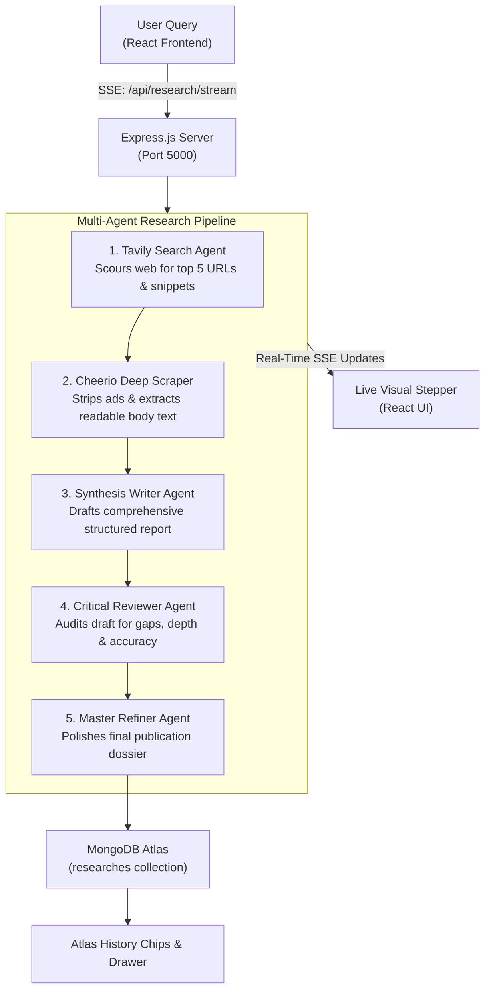

# DeepResearch AI 🚀
> **Autonomous Multi-Agent Deep Research Platform** built on the **MERN Stack** (MongoDB, Express, React, Node.js), powered by **Tavily AI Web Search**, **Cheerio Web Scraping**, and **Hugging Face Qwen-72B**.

---

## 📖 Overview

**DeepResearch AI** is an autonomous multi-agent research engine that replaces superficial LLM responses with thorough, multi-step investigation. 

Instead of relying solely on pre-trained model memory, DeepResearch AI deploys specialized agents that scour the live web, extract full-text content from primary source articles, draft structured intelligence dossiers, critique drafts for omissions or bias, and produce publication-ready markdown reports — streamed live to your browser and persisted in **MongoDB Atlas**.

---

## 🌟 Key Features

- 🔍 **Real-Time Web Intelligence**: Integrates **Tavily AI Search** to discover authoritative, up-to-the-minute web articles and citations.
- 🕸️ **Headless Web Scraping**: Uses **Cheerio** to visit primary URLs, strip advertising noise and boilerplate (`<nav>`, `<script>`, `<style>`), and harvest dense article paragraphs.
- 🤖 **Multi-Agent Editorial Pipeline**:
  1. **Search Agent**: Scours live web links.
  2. **Reader Agent**: Scrapes deep full-text context.
  3. **Writer Agent**: Synthesizes findings into a structured initial draft.
  4. **Critic Agent**: Acts as senior peer reviewer, providing 3–4 actionable improvements.
  5. **Refiner Agent**: Produces the final, publication-grade dossier.
- ⚡ **Real-Time Telemetry Streaming**: Implements **Server-Sent Events (SSE)** to update the 5-stage UI stepper in real time without polling.
- 💾 **MongoDB Atlas Cloud Storage**: Automatically persists all sessions (topics, search snippets, scraped content, critiques, and final reports).
- 🎨 **Modern Minimalist UI**: Built with React, Vite, and Lucide icons featuring quick topic chips, tabbed dossier views, copy/download markdown actions, and clickable history chips.

---

## 🏗️ Architecture



---

## 🛠️ Tech Stack

| Layer | Technology | Purpose |
| :--- | :--- | :--- |
| **Frontend** | React 19, Vite, Lucide Icons | Responsive UI, interactive stepper, tabs, Markdown viewer |
| **Backend** | Node.js, Express.js (ES Modules) | REST APIs, Server-Sent Events (SSE) streaming |
| **Database** | MongoDB Atlas, Mongoose | Persistent cloud storage for research dossiers |
| **Web Search** | Tavily AI Search API | Real-time web index queries and clean context snippets |
| **Scraper** | Cheerio | Fast HTML parsing, noise removal, and article extraction |
| **AI Models** | Hugging Face (`Qwen/Qwen2.5-72B-Instruct`) | Drafting, critical evaluation, and final report refinement |

---

## 🚀 Getting Started

### 1. Prerequisites
- **Node.js** (v18 or higher recommended)
- **MongoDB Atlas** account (or local MongoDB)
- **Tavily API Key** ([tavily.com](https://tavily.com))
- **Hugging Face Token** ([huggingface.co](https://huggingface.co))

---

### 2. Installation

Clone the repository:
```bash
git clone https://github.com/ArchanaGupta2205/DeepResearch-AI.git
cd DeepResearch-AI
```

#### Install Backend Dependencies:
```bash
cd backend
npm install
```

#### Install Frontend Dependencies:
```bash
cd ../frontend
npm install
```

---

### 3. Environment Variables

Create a `.env` file in the `backend/` folder:

```env
# API Keys
TAVILY_API_KEY="your_tavily_api_key_here"
HUGGINGFACEHUB_API_TOKEN="your_huggingface_token_here"

# Server & Database
PORT=5000
MONGODB_URI="mongodb+srv://<username>:<password>@<cluster>.mongodb.net/genai_research?retryWrites=true&w=majority"
```

---

### 4. Running the Application

#### Start Backend Server (Port 5000):
```bash
cd backend
npm run dev
```

#### Start Frontend Client (Port 5173 / 5174):
```bash
cd frontend
npm run dev
```

Open your browser at **`http://localhost:5173`** (or the port indicated in the terminal).

---

## 📡 API Endpoints

| Method | Endpoint | Description |
| :--- | :--- | :--- |
| `GET` | `/api/health` | Healthcheck diagnostics & database connection status |
| `GET` | `/api/research/stream?query=...` | **SSE stream** delivering real-time progress and completed report |
| `POST` | `/api/research` | Standard JSON endpoint to run research and save to MongoDB |
| `GET` | `/api/research` | Retrieves research history from MongoDB Atlas |
| `GET` | `/api/research/:id` | Fetches a single research dossier by ID |
| `DELETE` | `/api/research/:id` | Deletes a research report from the database |

---

## 📂 Project Structure

```
DeepResearch-AI/
├── backend/
│   ├── .env                    # Environment variables & API keys
│   ├── index.js                # Express app, MongoDB connection & SSE routes
│   ├── models/
│   │   └── Research.js         # Mongoose schema for research reports
│   ├── tools/
│   │   ├── tavily.js           # Tavily web search integration
│   │   └── cheerio.js          # Cheerio deep webpage scraper
│   └── agents/
│       ├── llm.js              # Hugging Face Qwen-72B completion client
│       ├── agent.js            # Writer, Critic, and Refiner agent prompts
│       └── pipeline.js         # 5-stage pipeline coordinator
└── frontend/
    ├── src/
    │   ├── App.jsx             # React dashboard, live stepper, and tabs
    │   ├── App.css             # Layout and responsive styling
    │   └── main.jsx            # React root entry point
    ├── index.html              # HTML shell & Google Fonts
    └── vite.config.js          # Vite config with backend proxy on port 5000
```

---

## 📄 License
This project is open-source and available under the [ISC License](LICENSE).
